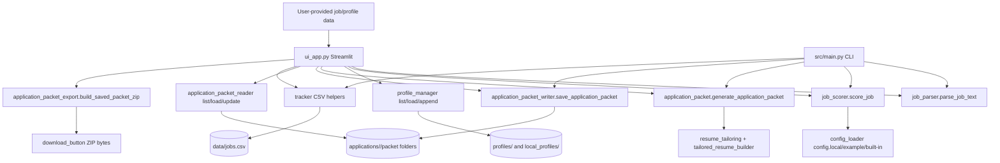

# Project Map: Job Packet Studio

## Overview

Job Packet Studio is a local-first Python/Streamlit app for taking user-provided job text, parsing/scoring it, generating reviewable application packets, and tracking saved applications without scraping, credentials, external AI calls, or auto-apply behavior. The UI is a single Streamlit entry file that imports deterministic parser/scorer/profile/packet/tracker modules from `src/` after adding `src` to `sys.path` (`ui_app.py:14-17`, `ui_app.py:19-46`). The CLI entry point in `src/main.py` exposes the same core packet/tracker workflows (`src/main.py:38-102`).

## How To Run

Python version observed locally: `Python 3.13.3`.

Setup and Streamlit launch:

```powershell
cd C:\Users\lesco\Desktop\job-search-agent
python -m venv .venv
.\.venv\Scripts\Activate.ps1
python -m pip install -r requirements.txt
python -m streamlit run ui_app.py
```

Launcher script: `powershell -ExecutionPolicy Bypass -File .\scripts\run_app.ps1`; it activates `.venv` if present and runs `python -m streamlit run ui_app.py` (`scripts/run_app.ps1:1-24`).

CLI sample:

```powershell
python .\src\main.py .\data\sample_job.txt
```

Tests:

```powershell
python -m pytest
```

Current result: `248 passed in 2.61s`.

Dependencies:

| File | Dependency | Purpose |
| --- | --- | --- |
| `requirements.txt:1` | `streamlit` | UI framework used by `ui_app.py` (`ui_app.py:12`, `ui_app.py:128-129`). |
| `requirements-dev.txt:1` | `pytest` | Test runner; repo config sets local basetemp (`pytest.ini:1-2`). |

## File Inventory

| File | Type | Purpose |
| --- | --- | --- |
| `.gitignore` | config | Ignores virtualenv, private/generated data, pytest temp/cache, local resumes; pytest entries are present at `.gitignore:25-27`. |
| `pytest.ini` | config | Pytest config uses repo-local basetemp via `addopts = --basetemp=.pytest_tmp` (`pytest.ini:1-2`). |
| `requirements.txt` | config | Runtime dependency list: Streamlit (`requirements.txt:1`). |
| `requirements-dev.txt` | config | Dev/test dependency list: pytest (`requirements-dev.txt:1`). |
| `README.md` | docs | Project overview, quick start, feature map, privacy boundaries, test commands (`README.md:1-76`). |
| `UI_AUDIT.md` | docs | UI audit report created for frontend review. |
| `ui_app.py` | Streamlit source | Main UI, styling, stateful workflows, saved packet review, advanced tabs (`ui_app.py:128-189`). |
| `src/main.py` | CLI source | CLI dispatcher for scoring, packet save/list/update/today/validation/generation commands (`src/main.py:38-102`). |
| `src/job_parser.py` | source | Parses job text into metadata (`src/job_parser.py:59-128`). |
| `src/job_scorer.py` | source | Scores parsed jobs and extracts requirements (`src/job_scorer.py:201-320`). |
| `src/config_loader.py` | source | Loads `config.local.json`, `config.example.json`, or built-in scoring config (`src/config_loader.py:49-76`). |
| `src/profile_manager.py` | source | Lists/loads committed and local profiles, parses proof blocks, appends proof blocks (`src/profile_manager.py:25-128`, `src/profile_manager.py:131-193`). |
| `src/resume_evidence.py` | source | Normalizes resume/profile evidence records and bullets (`src/resume_evidence.py:18-110`). |
| `src/resume_tailoring.py` | source | Builds requirement-to-evidence tailoring plans (`src/resume_tailoring.py:49-112`). |
| `src/tailored_resume_builder.py` | source | Turns tailoring plans into Markdown resume drafts (`src/tailored_resume_builder.py:14-122`). |
| `src/application_packet.py` | source | Main deterministic packet generator (`src/application_packet.py:29-90`). |
| `src/application_packet_writer.py` | source | Writes packet folders/files and packet index (`src/application_packet_writer.py:9-20`, `src/application_packet_writer.py:42-107`). |
| `src/application_packet_reader.py` | source | Reads saved packet summaries/details/review sections and updates tracking (`src/application_packet_reader.py:17-56`, `src/application_packet_reader.py:59-78`, `src/application_packet_reader.py:232-364`). |
| `src/application_packet_validator.py` | source | Validates required/optional saved packet artifacts (`src/application_packet_validator.py:21-60`). |
| `src/application_packet_export.py` | source | Builds deterministic ZIP bytes for saved packets (`src/application_packet_export.py:18-49`). |
| `src/application_generator.py` | source | Legacy file-based resume/cover-letter/match-note draft generator (`src/application_generator.py:23-59`). |
| `src/job_packet_agent.py` | source | Deterministic structured review wrapper around parse/score/packet flow (`src/job_packet_agent.py:12-51`). |
| `src/tracker.py` | source | Local CSV job tracker read/filter/update/repair/save (`src/tracker.py:10-35`, `src/tracker.py:64-199`). |
| `scripts/run_app.ps1` | script | Windows launcher for Streamlit app (`scripts/run_app.ps1:1-24`). |
| `scripts/smoke_packet_flow.py` | script | End-to-end fixture smoke test that writes to a temporary directory (`scripts/smoke_packet_flow.py:35-77`). |
| `config.example.json` | config/data | Example scoring config loaded after `config.local.json` fallback logic (`src/config_loader.py:67-76`). |
| `data/sample_job.txt` | data | Default/sample job file used by CLI constant `SAMPLE_JOB_PATH` (`src/main.py:29`). |
| `profiles/default/profile.json` | data | Committed demo profile metadata loaded from profile directories (`src/profile_manager.py:92-128`). |
| `profiles/default/resume_base.md` | data | Committed demo resume/profile text read by profile loader (`src/profile_manager.py:109-124`). |
| `docs/demo_saved_packet/*` | docs/data | Non-private saved packet example; validator/export tests read it (`tests/test_demo_saved_packet.py:11-25`). |
| `tests/conftest.py` | test config | Adds `src/` to import path for tests (`tests/conftest.py:1-10`). |
| `tests/fixtures/jobs/*.txt` | test data | Fixture postings for parser/scorer/packet smoke tests (`scripts/smoke_packet_flow.py:21-24`). |
| `tests/fixtures/profiles/test_profile/resume_base.md` | test data | Fixture profile/resume text for smoke tests (`scripts/smoke_packet_flow.py:26`). |
| `tests/test_ui_app.py` | test | UI helper, input cleaning, browser capture, saved packet UI helper, evidence suggestion tests (`tests/test_ui_app.py:77-929`). |
| `tests/test_main.py` | test | CLI missing-file/list/profile/validator command behavior (`tests/test_main.py:15-124`). |
| `tests/test_job_parser.py` | test | Job metadata parsing and noisy copied-post handling (`tests/test_job_parser.py:8-206`). |
| `tests/test_job_scorer.py` | test | Scoring, explanations, and requirement extraction (`tests/test_job_scorer.py:42-249`). |
| `tests/test_job_packet_agent.py` | test | Deterministic agent wrapper validation/warnings/structured review (`tests/test_job_packet_agent.py:18-69`). |
| `tests/test_application_packet.py` | test | Packet generation, safety, evidence, FEI/Arrivia strategy, tailored resume content (`tests/test_application_packet.py:1-500+`). |
| `tests/test_application_packet_writer.py` | test | Saved packet file creation, JSON safety, folder uniqueness, review order (`tests/test_application_packet_writer.py:142-361`). |
| `tests/test_application_packet_reader.py` | test | Saved packet listing/filtering/sorting/status/today queue/profile roots (`tests/test_application_packet_reader.py:1-746`). |
| `tests/test_application_packet_validator.py` | test | Required/optional packet artifact validation (`tests/test_application_packet_validator.py:44-125`). |
| `tests/test_application_packet_export.py` | test | ZIP export contents/order/safety/error cases (`tests/test_application_packet_export.py:1-80+`). |
| `tests/test_application_generator.py` | test | Legacy generator keyword matching/output files/review warning (`tests/test_application_generator.py:13-103`). |
| `tests/test_config_loader.py` | test | Built-in/example/local scoring config precedence (`tests/test_config_loader.py:7-13`). |
| `tests/test_profile_manager.py` | test | Profile loading/overrides/proof parsing/appending (`tests/test_profile_manager.py:65-211`). |
| `tests/test_resume_evidence.py` | test | Evidence normalization and profile evidence extraction (`tests/test_resume_evidence.py:13-169`). |
| `tests/test_resume_tailoring.py` | test | Tailoring-plan matching/gaps/determinism (`tests/test_resume_tailoring.py:33-91`). |
| `tests/test_tailored_resume_builder.py` | test | Markdown resume draft behavior/safety/determinism (`tests/test_tailored_resume_builder.py:44-156`). |
| `tests/test_tracker.py` | test | CSV tracker save/read/filter/update/repair (`tests/test_tracker.py:32-162`). |
| `tests/test_packet_flow_smoke.py` | test | Pytest version of Arrivia/FEI packet-flow smoke (`tests/test_packet_flow_smoke.py:36-87`). |
| `tests/test_demo_saved_packet.py` | test | Demo packet validates and exports known files (`tests/test_demo_saved_packet.py:11-25`). |

## Architecture Diagram



## Screen Map

| User surface | Render function / location | First-load or gated |
| --- | --- | --- |
| Page config/header/workflow strip | `main()` sets page at `ui_app.py:128-129`; header rendered at `ui_app.py:134`; HTML helpers at `ui_app.py:387-420` | First load |
| Local workflow explanation | `_show_welcome_section()` (`ui_app.py:655-663`) | First load, collapsed expander |
| Step 1 profile selector | `_show_profile_selector()` called at `ui_app.py:138-142`, defined at `ui_app.py:2865-2929` | First load |
| Profile/proof library | `_show_proof_library()` called inside selector at `ui_app.py:2924`, defined at `ui_app.py:2932-2997` | Expander |
| Step 2/3 guided packet builder | `_show_guided_packet_builder()` called at `ui_app.py:145-149`, defined at `ui_app.py:666-776` | First load |
| Other intake helpers | `_show_local_intake_helper()` (`ui_app.py:832-866`) and browser capture (`ui_app.py:1158-1262`) | Expander/radio |
| Generated packet result | `_show_generated_packet_result()` (`ui_app.py:925-940`) after `builder_packet` exists (`ui_app.py:770-776`) | Conditional |
| Packet preview tabs | `_show_packet_preview()` tabs at `ui_app.py:2067-2119` | Conditional |
| Saved packet review | `_show_saved_packet_review()` called inside expander at `ui_app.py:147-148`, defined at `ui_app.py:2231-2283` | Expander |
| Advanced tool tabs | `st.tabs([...])` at `ui_app.py:153-162` | Expander |
| Dashboard tab | `_show_dashboard()` (`ui_app.py:2304-2347`) | Advanced tab |
| Today tab | `_show_today_tab()` (`ui_app.py:2350-2389`) | Advanced tab |
| Score a Job tab | `_show_score_job_tab()` (`ui_app.py:2407-2445`) | Advanced tab |
| Tracker tab | `_show_tracker_tab()` (`ui_app.py:2448-2494`) | Advanced tab |
| Application Packets tab | `_show_application_packets_tab()` (`ui_app.py:2497-2545`) | Advanced tab |
| Saved applications tab | `_show_saved_applications_tab()` (`ui_app.py:2548-2616`) | Advanced tab |

## Function Clusters

### `ui_app.py`

| Cluster | Functions |
| --- | --- |
| Entry/layout | `main` (`ui_app.py:128`, 62 lines), `_show_welcome_section` (`ui_app.py:655`). |
| CSS/static HTML | `app_style_css` (`ui_app.py:220`, 165 lines, refactor candidate), `app_header_html` (`ui_app.py:391`), `workflow_strip_html` (`ui_app.py:405`), `step_card_html` (`ui_app.py:427`), `status_badge_html` (`ui_app.py:438`), `detected_detail_chips` (`ui_app.py:450`). |
| Job intake/cleaning | `clean_job_posting_text` (`ui_app.py:497`), `html_unescape_job_text` (`ui_app.py:524`), `extract_job_url` (`ui_app.py:539`), `summarize_job_input_quality` (`ui_app.py:546`), `read_uploaded_job_file` (`ui_app.py:574`), `_show_guided_packet_builder` (`ui_app.py:666`, 111 lines, refactor candidate), `_show_job_input_quality` (`ui_app.py:797`), `_show_local_intake_helper` (`ui_app.py:832`), `_show_detected_job_details` (`ui_app.py:873`). |
| Browser capture/local import | `_show_job_intake_mode` (`ui_app.py:1158`, 105 lines, refactor candidate), `extract_uploaded_job_text` (`ui_app.py:1293`), `extract_readable_html_text` (`ui_app.py:1301`), `clean_captured_job_text` (`ui_app.py:1317`), `choose_browser_capture_text` (`ui_app.py:1330`), browser instruction helpers (`ui_app.py:1349-1415`), `build_browser_capture_bookmarklet` (`ui_app.py:1418`). |
| Packet generation/review UI | `_show_generated_packet_result` (`ui_app.py:925`), `_show_compact_packet_result` (`ui_app.py:943`), `_show_builder_save_controls` (`ui_app.py:1485`), `_show_analysis_summary` (`ui_app.py:1605`), `_show_evidence_check` (`ui_app.py:1654`), `_suggest_evidence_for_requirement` (`ui_app.py:1757`, 114 lines, refactor candidate), `_show_packet_preview` (`ui_app.py:2067`), `_show_next_action_section` (`ui_app.py:2122`). |
| Saved packet UI | `_show_saved_packet_folder_location` (`ui_app.py:976`), validation/ZIP helpers (`ui_app.py:987-1069`), `packet_summary_card_data/html` (`ui_app.py:1072-1117`), `_show_saved_packet_review` (`ui_app.py:2231`), `_show_saved_packet_status_controls` (`ui_app.py:2723`). |
| Advanced tabs | `_show_dashboard` (`ui_app.py:2304`), `_show_today_tab` (`ui_app.py:2350`), `_show_score_job_tab` (`ui_app.py:2407`), `_show_tracker_tab` (`ui_app.py:2448`), `_show_application_packets_tab` (`ui_app.py:2497`), `_show_saved_applications_tab` (`ui_app.py:2548`), `_show_saved_application_filters` (`ui_app.py:2628`, 93 lines, refactor candidate). |
| Profile UI | `_show_profile_selector` (`ui_app.py:2865`), `_show_proof_library` (`ui_app.py:2932`). |
| Formatting/state helpers | `packet_start_here_items` (`ui_app.py:603`), `html_list` (`ui_app.py:1120`), `top_packet_supported_items` (`ui_app.py:1127`), `packet_next_actions` (`ui_app.py:1145`), `_saved_packets_for_queue` (`ui_app.py:3339`), `_score_analysis_key` (`ui_app.py:3422`), `_dedupe` (`ui_app.py:3456`). |

### `src/`

| Module | Function clusters |
| --- | --- |
| `src/main.py` | CLI dispatcher `main` (`src/main.py:38`), command handlers (`src/main.py:105-393`), arg/print helpers (`src/main.py:396-640`). |
| `src/job_parser.py` | Main parse `parse_job_text` (`src/job_parser.py:59`), label/top-line inference helpers (`src/job_parser.py:131-387`). |
| `src/job_scorer.py` | Score/explain/requirements (`src/job_scorer.py:201-320`), explanation pieces (`src/job_scorer.py:323-493`), keyword/experience helpers (`src/job_scorer.py:519-674`). |
| `src/application_packet.py` | Main packet generator `generate_application_packet` (`src/application_packet.py:29`, 154 lines, refactor candidate), strategy/evidence/decision builders (`src/application_packet.py:285-798`), cover letter/resume/recruiter builders (`src/application_packet.py:801-1541`; `_build_tailored_resume_draft` 105 lines), support/risk/dedupe helpers (`src/application_packet.py:1558-1981`). |
| `src/application_packet_writer.py` | Packet filenames/order constants (`src/application_packet_writer.py:9-20`), save/write flow (`src/application_packet_writer.py:42-107`), markdown/JSON payload builders (`src/application_packet_writer.py:192-478`). |
| `src/application_packet_reader.py` | Status/review constants (`src/application_packet_reader.py:17-56`), list/filter/sort/today queue (`src/application_packet_reader.py:59-229`), load/update/sanitize helpers (`src/application_packet_reader.py:232-569`). |
| `src/application_packet_validator.py` | Validate required/optional files (`src/application_packet_validator.py:21-60`). |
| `src/application_packet_export.py` | Build deterministic ZIP (`src/application_packet_export.py:18-49`). |
| `src/profile_manager.py` | Profile list/load/app dir (`src/profile_manager.py:25-89`), metadata/proof parsing (`src/profile_manager.py:92-154`), proof append/format helpers (`src/profile_manager.py:157-307`). |
| `src/tracker.py` | CSV fields (`src/tracker.py:10-21`), read/filter/update/repair/write/save (`src/tracker.py:24-199`), normalization helpers (`src/tracker.py:202-264`). |
| `src/resume_evidence.py` | Normalize evidence and bullets (`src/resume_evidence.py:18-110`), low-level field helpers (`src/resume_evidence.py:113-198`). |
| `src/resume_tailoring.py` | Build tailoring plan (`src/resume_tailoring.py:49-112`), normalize/match helpers (`src/resume_tailoring.py:115-280`). |
| `src/tailored_resume_builder.py` | Build Markdown resume draft (`src/tailored_resume_builder.py:14`, 109 lines, refactor candidate), formatting helpers (`src/tailored_resume_builder.py:125-200`). |
| `src/application_generator.py` | Legacy file-based draft generation (`src/application_generator.py:23-59`), slug/keyword/draft helpers (`src/application_generator.py:62-197`). |
| `src/config_loader.py` | Built-in config and local/example config loading (`src/config_loader.py:12-76`). |
| `src/job_packet_agent.py` | Deterministic review wrapper (`src/job_packet_agent.py:12-51`), summary/warning helpers (`src/job_packet_agent.py:54-136`). |

## Call Graph

Main Streamlit render path:

- `main` (`ui_app.py:128`) -> `inject_app_styles` (`ui_app.py:216`) -> `app_style_css` (`ui_app.py:220`).
- `main` -> `render_app_header` (`ui_app.py:387`) -> `app_header_html` (`ui_app.py:391`) -> `workflow_strip_html` (`ui_app.py:405`).
- `main` -> `_show_welcome_section` (`ui_app.py:655`).
- `main` -> `_show_profile_selector` (`ui_app.py:2865`) -> `list_profiles` (`src/profile_manager.py:25`) and `_show_proof_library` (`ui_app.py:2932`).
- `main` -> `_show_guided_packet_builder` (`ui_app.py:666`) -> `read_uploaded_job_file` (`ui_app.py:574`), `summarize_job_input_quality` (`ui_app.py:546`), `parse_job_text` (`src/job_parser.py:59`), `_show_detected_job_details` (`ui_app.py:873`).
- On Generate: `_show_guided_packet_builder` -> `_build_guided_job_text` (`ui_app.py:1265`) -> `parse_job_text` (`src/job_parser.py:59`) -> `score_job` (`src/job_scorer.py:201`) -> `_suggest_evidence_answers` (`ui_app.py:1739`) -> `generate_application_packet` (`src/application_packet.py:29`) -> session state writes (`ui_app.py:758-768`).
- If packet exists: `_show_generated_packet_result` (`ui_app.py:925`) -> `_show_compact_packet_result` (`ui_app.py:943`) -> `_show_builder_save_controls` (`ui_app.py:1485`) -> `save_application_packet` (`src/application_packet_writer.py:42`); then `_show_packet_preview` (`ui_app.py:2067`).

CLI path:

- `src/main.py:38-55` dispatches subcommands.
- Default score path reads job text (`src/main.py:73-83`), loads profile (`src/main.py:60`, `src/main.py:411-421`), parses/scores/generates optional packet (`src/main.py:82-97`), then saves tracker row (`src/main.py:100`).

Surprising/tight dependencies:

- `ui_app.py` mutates `sys.path` to import `src` modules directly (`ui_app.py:14-17`); `scripts/smoke_packet_flow.py` does the same (`scripts/smoke_packet_flow.py:12-15`).
- UI imports nearly every domain module at top level (`ui_app.py:19-46`), so UI and business logic are tightly coupled.
- No Python functions are obviously dead by simple repo-wide symbol search after URL import and old builder removal; `UI_AUDIT.md` is docs-only and not part of runtime.

## State And Data

### Streamlit `st.session_state`

| Key | Written | Read | Holds |
| --- | --- | --- | --- |
| `builder_job_text` | upload/sample/capture helpers (`ui_app.py:787`, `ui_app.py:837`, `ui_app.py:854`, `ui_app.py:1195`, `ui_app.py:1255`) | Streamlit text area key at `ui_app.py:695-699` | Current guided-builder job text. |
| `builder_uploaded_job_key` | `ui_app.py:788` | `ui_app.py:785` | Dedup key for uploaded file name/size. |
| `builder_job` | `ui_app.py:758` | `ui_app.py:770` | Parsed job dict. |
| `builder_score_details` | `ui_app.py:759` | `ui_app.py:771` | Score result dict from `score_job`. |
| `builder_full_job_text` | `ui_app.py:760` | `ui_app.py:1545` | Cleaned + overridden full job text for agent review. |
| `builder_source_url` | `ui_app.py:761` | Not used elsewhere except state retention. |
| `builder_analysis_key` | `ui_app.py:762` | Not used elsewhere in current UI. |
| `builder_evidence_answers` | `ui_app.py:763` | Not used elsewhere in current UI. |
| `builder_packet` | `ui_app.py:764` | `ui_app.py:772` | Generated application packet dict. |
| `builder_packet_analysis_key` | `ui_app.py:765` | Not used elsewhere in current UI. |
| `builder_saved_packet` | cleared at `ui_app.py:766`, written at `ui_app.py:1517` | `ui_app.py:931`, `ui_app.py:934` | Save result with `folder_path` and `output_paths`. |
| `builder_agent_review` | cleared at `ui_app.py:767`, written at `ui_app.py:1549`/`ui_app.py:1555` | `ui_app.py:1558` | Deterministic agent review dict. |
| `builder_agent_analysis_key` | cleared at `ui_app.py:768`, written at `ui_app.py:1553`/`ui_app.py:1556` | `ui_app.py:1544` | Cache key for agent review. |
| `scored_job` | `ui_app.py:2421` | `ui_app.py:2428` | Advanced Score a Job parsed job. |
| `score_details` | `ui_app.py:2422` | `ui_app.py:2429` | Advanced Score a Job score result. |
| `scored_job_text` | `ui_app.py:2423` | Not used elsewhere. |
| `save_message` | cleared/written/read at `ui_app.py:2424`, `ui_app.py:2438`, `ui_app.py:2440` | Tracker save result. |
| `score_application_packet` | cleared/written/read at `ui_app.py:2425`, `ui_app.py:3066`, `ui_app.py:3072` | Packet generated from advanced Score a Job flow. |
| `saved_score_application_packet` | cleared/written/read at `ui_app.py:2426`, `ui_app.py:3084`, `ui_app.py:3086` | Saved packet result in advanced flow. |
| `active_profile_id` | read/write at `ui_app.py:2925-2926` | Selected profile id used to clear stale advanced packets. |

### Core data shapes

- **Profile dict**: built in `_load_profile_dir` with `profile_id`, `display_name`, `target_roles`, `notes`, paths, `resume_text`, `proof_blocks`, local/default/source flags (`src/profile_manager.py:116-128`). Profiles load from `profiles/` and `local_profiles/` (`src/profile_manager.py:25-39`).
- **Job dict**: `parse_job_text` returns parsed metadata including title/company/location/work mode/raw text; main usage is `job = parse_job_text(job_text)` in CLI (`src/main.py:82`) and UI (`ui_app.py:711`, `ui_app.py:741`).
- **Score result dict**: created by `score_job` and includes score, recommendation, matched/missing keywords, concerns, explanation, requirements; consumed by packet generation (`src/application_packet.py:35-44`).
- **Packet dict**: `generate_application_packet` assembles metadata, evidence, decision, resume/cover/recruiter/checklist/risk outputs (`src/application_packet.py:29-90`).
- **Saved packet folder**: writer creates Markdown/TXT/JSON files named by `PACKET_FILENAMES` and index order constants (`src/application_packet_writer.py:9-20`), writes them to `applications/<profile_id>/<date_company_title>/` (`src/application_packet_writer.py:42-107`).
- **Saved application summary/details**: reader walks packet roots and loads packet JSON (`src/application_packet_reader.py:59-78`, `src/application_packet_reader.py:232-257`).
- **CSV tracker rows**: fixed fields are `title`, `company`, `location`, `score`, `recommendation`, `status`, `notes`, `source_url`, `date_found`, `follow_up_date` (`src/tracker.py:10-21`).

### Persistence

- `applications/`: generated packet folders written by `save_application_packet` (`src/application_packet_writer.py:49-107`).
- `data/jobs.csv`: local tracker CSV path constants in UI/CLI (`ui_app.py:14-15`, `src/main.py:30`), read/written by tracker helpers (`src/tracker.py:24-35`, `src/tracker.py:146-199`).
- `profiles/` and `local_profiles/`: profile roots loaded by `profile_manager` (`src/profile_manager.py:25-39`).
- `config.local.json` / `config.example.json`: scoring config precedence (`src/config_loader.py:67-76`).
- `output/`: legacy application generator output (`src/application_generator.py:23-59`).

## External Touch Points

| Surface | Location | Local-first alignment |
| --- | --- | --- |
| Streamlit server | `python -m streamlit run ui_app.py` via `scripts/run_app.ps1:24` | Local app UI. |
| User file uploads | Guided upload `ui_app.py:675-679`, browser capture upload `ui_app.py:1242-1255`, legacy `_get_job_text_input` upload `ui_app.py:3000-3011` | User-provided local files; aligns. |
| File reads | Sample fixtures `ui_app.py:853`, `ui_app.py:1194`; profile metadata/resume `src/profile_manager.py:100-124`; job text CLI `src/main.py:475-483`; config `src/config_loader.py:58-59` | Local filesystem only; aligns. |
| File writes | Packet writer `src/application_packet_writer.py:49-107`; tracker CSV `src/tracker.py:146-199`; proof block append `src/profile_manager.py:157-193`; legacy generator `src/application_generator.py:35-49` | Local/generated artifacts; aligns. |
| ZIP export | `build_saved_packet_zip` reads packet files into in-memory ZIP (`src/application_packet_export.py:18-49`); UI download button at `ui_app.py:1050-1069` | Local export only; aligns. |
| Browser capture bookmarklet | JS string reads selected text/body text and downloads `captured-job-posting.txt` (`ui_app.py:1418-1437`) | User-initiated capture of open page text; no cookies/local storage in code; aligns with stated local capture boundary. |
| Clipboard | UI explicitly says it does not read clipboard (`ui_app.py:858-862`) | Aligns. |
| Network calls | None found in current runtime source after URL import removal. |
| Subprocess/secrets/env vars | No `subprocess`, `st.secrets`, or environment-variable access found in app source. |

## Test Coverage

Command run:

```powershell
python -m pytest
```

Result: `248 passed in 2.61s`.

| Test file | Covers |
| --- | --- |
| `tests/test_ui_app.py` | UI helper HTML/text, job intake cleaning, upload parsing, browser capture safety, saved packet helper formatting, evidence suggestions (`tests/test_ui_app.py:77-929`). |
| `tests/test_main.py` | CLI missing-file, list, profile option, validator command paths (`tests/test_main.py:15-124`). |
| `tests/test_job_parser.py` | Labeled/noisy/narrative job parsing (`tests/test_job_parser.py:8-206`). |
| `tests/test_job_scorer.py` | Score bounds/config/explanations/requirements (`tests/test_job_scorer.py:42-249`). |
| `tests/test_job_packet_agent.py` | Structured review/warnings/profile integration (`tests/test_job_packet_agent.py:18-69`). |
| `tests/test_application_packet.py` | Packet safety, fit strategy, cover letter, proof blocks, tailored resume (`tests/test_application_packet.py`, many tests). |
| `tests/test_application_packet_writer.py` | Packet folder/file writing, JSON safety, review index (`tests/test_application_packet_writer.py:142-361`). |
| `tests/test_application_packet_reader.py` | Saved packet list/filter/sort/update/today queue/profile roots (`tests/test_application_packet_reader.py:1-746`). |
| `tests/test_application_packet_validator.py` | Required/optional artifact validation (`tests/test_application_packet_validator.py:44-125`). |
| `tests/test_application_packet_export.py` | ZIP export content/order/safety/errors. |
| `tests/test_profile_manager.py` | Profile list/load/local override/proof blocks (`tests/test_profile_manager.py:65-211`). |
| `tests/test_tracker.py` | CSV save/read/filter/update/repair (`tests/test_tracker.py:32-162`). |
| `tests/test_resume_evidence.py` | Evidence normalization/extraction (`tests/test_resume_evidence.py:13-169`). |
| `tests/test_resume_tailoring.py` | Requirement/evidence matching plan (`tests/test_resume_tailoring.py:33-91`). |
| `tests/test_tailored_resume_builder.py` | Markdown draft content/safety/determinism (`tests/test_tailored_resume_builder.py:44-156`). |
| `tests/test_packet_flow_smoke.py` and `scripts/smoke_packet_flow.py` | End-to-end Arrivia/FEI fixture packet flows (`tests/test_packet_flow_smoke.py:36-87`, `scripts/smoke_packet_flow.py:35-77`). |
| `tests/test_demo_saved_packet.py` | Demo packet validation/export (`tests/test_demo_saved_packet.py:11-25`). |
| `tests/test_config_loader.py` | Config fallback/override (`tests/test_config_loader.py:7-13`). |

Notable gaps:

- Streamlit rendering itself is not browser/a11y tested; tests focus on pure helpers and data logic.
- The full interactive save/update workflows are tested mostly through module helpers, not through a running Streamlit session.
- `scripts/run_app.ps1` launcher behavior has no test.

## Notable Observations

- Oversized/refactor candidates: `app_style_css` 165 lines (`ui_app.py:220`), `_show_guided_packet_builder` 111 lines (`ui_app.py:666`), `_show_job_intake_mode` 105 lines (`ui_app.py:1158`), `_suggest_evidence_for_requirement` 114 lines (`ui_app.py:1757`), `_show_saved_application_filters` 93 lines (`ui_app.py:2628`), `generate_application_packet` 154 lines (`src/application_packet.py:29`), `_build_tailored_resume_draft` 105 lines (`src/application_packet.py:877`), `build_tailored_resume_draft` 109 lines (`src/tailored_resume_builder.py:14`).
- Tight coupling: `ui_app.py` imports parser/scorer/profile/packet/tracker/writer/reader modules directly at top level (`ui_app.py:19-46`).
- Local-first boundary is represented in code by lack of network calls, ignored local folders, local profile loading, and explicit clipboard non-access (`ui_app.py:858-862`, `src/profile_manager.py:25-39`, `src/application_packet_writer.py:42-107`).
- Packet JSON intentionally avoids raw job text via raw-text key sanitization constants in writer/reader (`src/application_packet_writer.py:31-37`, `src/application_packet_reader.py:9-15`).
